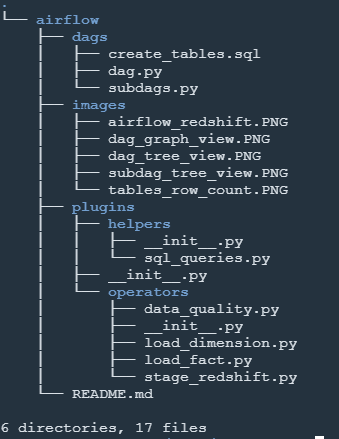
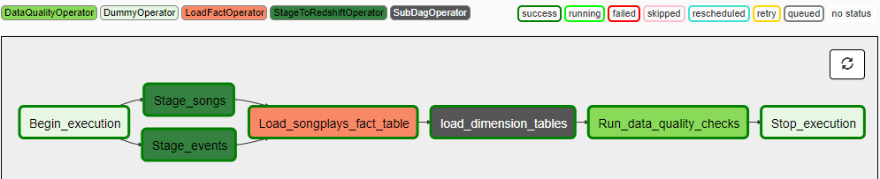
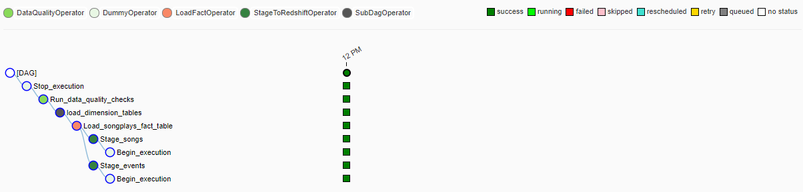
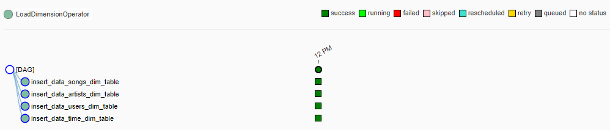
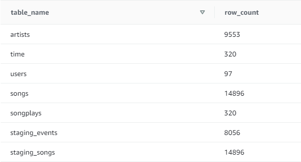

## Udacity - Data Engineering Nanodegree

### Project 4: Build reusable ETL on Amazon Redshift with Apache Airflow

#### Table of contents

* [Project Description](#project-description)  
* [Files in Repository](#files-in-repository)  
* [Setup](#setup)  
    *   [A. Set up access keys credentials on AWS IAM](#aws_iam_access_keys)
    *   [B. Create roles in AWS IAM](#aws_iam_roles)
    *   [C. Create Redshift cluster](#create_redshift_cluster)  
    *   [D. Create tables on Redshift cluster query editor](#create_tables)
    *   [E. Start Airflow webserver](#access_airflow_ui)
    *   [F. Add Airflow Connections and Variables](#airflow_connections_variables)
        *   [F. 1. Airflow Connections](#f1)
        *   [F. 2. Airflow Variables](#f2)
* [Tables in Redshift Database](#redshift-tables)
    *  [Fact Table](#fact-table)
    *  [Dimension Tables](#dimension-tables)
* [ETL Pipelines](#etl)
* [Row counts summary of the tables](#summary-table-info)

#### Project Description
In this project, an automation and monitoring of Sparkify's data warehouse ETL pipelines is executed with Apache Airflow.
The main goals of this project are to create high grade data pipelines that are dynamic and built from reusable tasks, can be monitored, and allow easy backfills. Data quality check will be included in the pipelines to confirm the integrity of data loaded from S3 buckets to Amazon Redshift.

#### Files in Repository

In addition to images folder, there are two other folders and a README file in the repository:
* `dags` folder that holds:  
    - `dag.py` instantiates a DAG object, configures operators and sets task dependencies.
    - `subdags.py` contains functions to generates a DAG to be used as a subDAG that runs LoadDimensionOperator on
        dimension tables.
    - `create_tables.sql` contains SQL scripts to create tables in Redshift cluster.
* `plugins` folder that holds subfolders and an `__init__` file:
    - `helpers` subfolder contains:
        - `__init__.py` contains setup to import SQL statement in `sql_queries.py`.
        - `sql_queries.py` contains SQL queries to transform data in Redshift cluster.
    - `operators` subfolder contains:
        - `__init__.py` contains setup to import operators.
        - `stage_redshift.py` contains operator to stage data from S3 in Redshift.
        - `load_fact.py` contains operator to append data from staging table to a fact table.
        - `load_dimension.py` contains operator to truncate all rows in a dimension table and insert data.
        - `data_quality.py` contains operator that performs row count and null value checks against tables in Redshift cluster.
    - `__init__.py` defines plugin class for operators and SQL queries in `sql_queries.py`.
* `README.md` provides discussion on this project.

#### Setup
The setup procedure to create an Amazon Redshift cluster, start the Airflow webserver and add Airflow Connections are outlined below:  

  **A. Set up access keys credentials on AWS IAM.**  
  As a best practice, create and use a temporary security credentials (IAM User) instead of using root user access keys which has unrestricted access to all the resources in your account. The steps to set up access keys on AWS IAM are as follows:  
  1. Create an IAM user on AWS IAM.  
  2. Specify user name, and access type as _Programmatic access_ only.  
  3. Set the permissions to the new user by attaching _AdministratorAccess_ policy from the list and click Next.  
  4. Review the details of the new user and create the new user.  
  5. Download the access key in .csv file containing the _Access Key ID_ and a _Secret Access Key_.
  6. Make sure the .csv file is saved in a known directory. It will be required to set up Airflow Connection in later steps.    

**B. Create Roles in AWS IAM**  
  1. Create Roles with _Redshift - Customizable_ as the use case, and click `Next: Permissions` button.  
  2. Tick _AdministratorAccess_ and _AmazonS3ReadOnlyAccess_ boxes to attach these policies to the list, and click `Next: Tags`.  
  3. Tag for the IAM role is optional, select `Next: Review` button to skip to the next step.  
  4. Enter `RedshiftRoleTest` as Role name, then select `Create role` button.

**C. Create Redshift Cluster**  
1. As the S3 data source is located in Oregon `us-west-2` region, make sure to change the Region on top of the Redshift page accordingly before creating Redshift cluster.  

2. Configure the Redshift cluster as per the following:
   - Cluster identifier: `ud-dend-p5-airflow`
   - Cluster use: `Production` radio button
   - Node type: `dc2.large`
   - Nodes: `4`

3. Configure the Database as follows:
    - Database name: `p5_airflowdb`
    - Database port: `5439`
    - Master user name: `awsuser-master`
    - Master user password: `PassW0rd`

4. Add an IAM role to access other AWS service (in this case S3) on your behalf by selecting the Role created in _[Step B](#aws_iam_roles)_ in the dropdown list and select Associate IAM role.

5. Toggle button on `Additional configurations` to make changes on `Network and Security`. Set the `Publicly accessible` option to `Yes`

6. Select `Create cluster` and wait while the cluster is being created.

**D. Create tables on Redshift cluster query editor**  
1. Navigate to Redshift Query editor and connect to database using details specified in _[Step C](#create_redshift_cluster)_.  
2. Copy SQL script in `create_tables.sql` and paste it on Redshift Query editor window.  
3. Click `Run` to run the SQL script.

Tables are now created under public schema.

**E. Start Airflow webserver**  
In Udacity Workspace, run `/opt/airflow/start.sh` on BASH terminal and wait for the web server to be ready before clicking `ACCESS AIRFLOW` button. The Airflow's UI will be shown in a new tab of your web browser window.  

For the case where Airflow is run on a local machine, the Airflow UI can be accessed on `http://localhost:8080` on Google Chrome.  

_Note_: Make sure to change the `Inbound rules` setting in `Security Groups` under `Network & Security` at EC2 Dashboard to allow incoming TCP protocol on Port 5439 (default endpoint port) and 8080 (default Airflow port).

**F. Add Airflow Connections and Variables**  

_F.1. Airflow Connections_  
On Airflow's UI, navigate to Admin tab and create connections to AWS and the Redshift cluster created by selecting `Connections` under `Admin` tab then select `Create` tab.  
-  AWS connection  
    To create an connection to AWS on Airflow, enter the following values:  
      - **Conn Id**: `aws_credentials`  
      - **Conn Type**: `Amazon Web Services`  
      - **Login**: Enter _Access key ID_ in the CSV file obtained from _[Step A](#aws_iam_access_keys)_.  
      - **Password**: Enter _Secret access key_ in the CSV file obtained from _[Step A](#aws_iam_access_keys)_.  

    Once the values have been entered, select `Save and Add Another` to save the setting and add the connection details to Redshift cluster.  

-  Redshift connection  
    To create the connection to Redshift cluster, enter the following values:  
      - **Conn Id**: `redshift`  
      - **Conn Type**: `Postgres`
      - **Host**: Navigate to the AWS Redshift Cluster page to obtain the Endpoint hostname (eg. `ud-dend-p5-airflow.xyz.us-west-2.redshift.amazonaws.com`). Note that the schema and port number details need to be removed after pasting the Endpoint.
      - **Schema**: `p5_airflowdb` (the database name entered when creating Redshift cluster in _[Step C](#create_redshift_cluster)_).
      - **Login**: `awsuser-master` (the master user name entered when creating Redshift cluster in _[Step C](#create_redshift_cluster)_).
      - **Password**: `PassW0rd` (the master user password entered when creating Redshift cluster in _[Step C](#create_redshift_cluster)_).
      - **Port**: `5439` (the database port entered when creating Redshift cluster in _[Step C](#create_redshift_cluster)_).  

    Once the values have been entered, select `Save` to save the setting.

_F.2. Airflow Variables_  
  On Airflow's UI, navigate to Admin tab and create variables for S3 path by selecting `Variables` under `Admin` tab then select `Create` tab. Enter the following `Key` and `Val` in the table below to set the variables in Airflow:  

  | Variables           | Key                 | Val                                    |
  | :------------------ | :------------------ |:-------------------------------------- |
  | S3 bucket           | `s3_bucket`         | `udacity-dend`                         |
  | Log data S3 key     | `s3_key_log`        | `log_data`                             |
  | Song data S3 key    | `s3_key_songs`      | `song_data`                            |
  | Log JSON format     | `s3_log_jsonpath`   | `s3://udacity-dend/log_json_path.json` |

#### Tables in Redshift database
The tables in Redshift database consist of:  

##### Fact Table

1.  **songplays** - records in log data associated with song plays i.e. records with page `NextSong`.
    * _songplay_id, start_time, user_id, level, song_id, artist_id, session_id, location, user_agent_

##### Dimension Tables

2.  **artists** - artists in music database.  
    * _artist_id, name, location, latitude, longitude_

3.  **songs** - songs in music database
    * _song_id, title, artist_id, year, duration_

4.  **users** - users in the app
    * _user_id, first_name, last_name, gender, level_

5.  **time** - timestamps of records in songplays broken down into specific units
    * _start_time, hour, day, week, month, year, weekday_

#### ETL Pipelines
The ETL pipelines in this project is shown in the graph below, with the following steps:

1. Song and event log datasets are loaded in parallel from S3 to staging tables (namely `staging_songs` and `staging_events`) using a COPY command.
2. The staging tables are then joined to obtain rows with matching song title, artist name and song duration where values of song id and artist id are not null. The resulting rows are appended into `songplays` table.
3. The dimension tables, `artists` and `songs` are loaded from `staging_songs` table whereas the `users` table are from `staging_events` table. The `time` table is populated from start_time column in `songplays` table that is broken down into hour, day, week, month, year and weekday columns. All rows in dimension tables are truncated before inserting the rows. The repeating pattern in loading dimension tables calls for the use of subDAG operator on `LoadDimensionOperator` as shown in the Airflow diagram below.

    

    

4. Finally, the `DataQualityOperator` performs check against tables in Redshift database whether the table returns any results, contains any rows or null values in specific column.

#### Row counts summary of the tables
The number of rows in each table in the Redshift cluster is as follow:  

